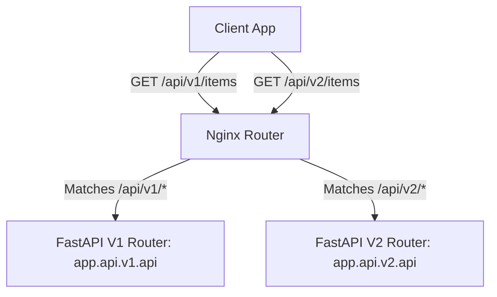
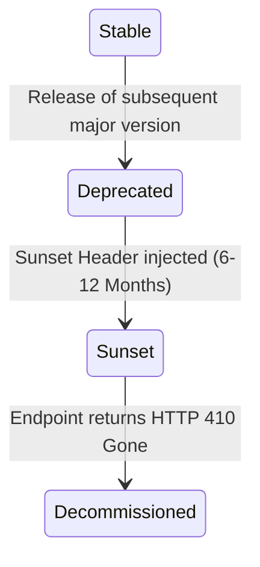

# Enterprise ERP: API Versioning Architecture

This document defines the REST API versioning guidelines, request routing, header handling, backward compatibility strategies, and deprecation/sunsetting lifecycles for the system.

---

## 1. Versioning Strategy: URI Prefixing

We adopt the **URI Prefixing** versioning scheme. This keeps versions explicit, self-documenting, and easy to cache at proxy layers (e.g. Nginx).

*   **Format:** `/api/v{version_number}/{resource_name}`
*   *Version 1 Target:* `/api/v1/work-orders` (Standard API, stable).
*   *Version 2 Target:* `/api/v2/work-orders` (Includes new structured query properties, in dev).



---

## 2. Directory Hierarchy and Import Scaffolds

Version routers are strictly isolated within separate Python directories:

```text
backend/app/api/
├── v1/
│   ├── endpoints/       # V1 controllers
│   └── api.py           # V1 composite router
└── v2/
    ├── endpoints/       # V2 controllers
    └── api.py           # V2 composite router
```

To avoid namespace clashes, endpoints inherit resource-specific wrappers (e.g. `from app.api.v1.endpoints import items as items_v1`).

---

## 3. Deprecation and Sunset Policies

To maintain system agility, older API versions follow a structured sunset timeline:



### 1. HTTP Warning Headers for Deprecated Routes
Deprecated endpoints must inject the standard RFC 8594 `Sunset` header in their responses:
```text
Sunset: Wed, 11 Nov 2026 00:00:00 GMT
Link: <https://api.industryone-erp.com/docs/v2>; rel="successor-version"
```

### 2. Client Fallback Handling
*   The frontend Axios client automatically parses HTTP warnings and prints warnings to logging tools when calling deprecated paths.
*   Once a version hits `Decommissioned` state, the endpoint returns an `HTTP 410 Gone` error envelope, blocking client execution.
