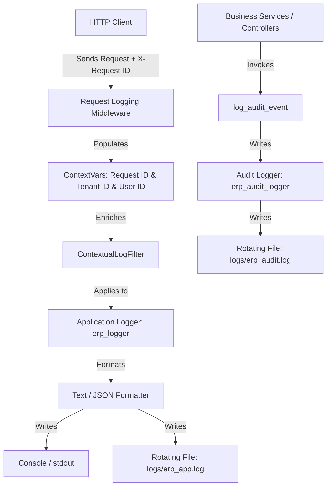

# Enterprise ERP: Centralized Logging System Architecture

This document defines the architecture, context management, formatters, correlation propagation, and audit logging standards for the ERP centralized logging system.

---

## 1. Architectural Overview

The Centralized Logging System provides end-to-end observability, distributed request correlation, multi-tenant context tracking, and security audit trails across all application layers.



---

## 2. Contextual Metadata Enrichment

Every log entry automatically captures contextual attributes via async-safe `contextvars`:

| Context Attribute | Source | Default | Description |
| :--- | :--- | :--- | :--- |
| `request_id` | `X-Request-ID` header or auto-generated `req_<uuid>` | `-` | Unique request correlation identifier |
| `tenant_id` | `TenantContext.get_current_tenant()` | `-` | Multi-tenant organization isolation ID |
| `user_id` | `get_user_id()` / Auth Dependency | `-` | Authenticated user/actor identifier |

---

## 3. Log Layout Formats

### Standard Text Format (Development & File Diagnostics)
```text
[%(asctime)s] [%(levelname)s] [req:%(request_id)s] [tenant:%(tenant_id)s] [user:%(user_id)s] [%(filename)s:%(lineno)d] - %(message)s
```

Example:
```text
[2026-08-15 13:35:18] [INFO] [req:req_a1b2c3d4e5f6] [tenant:tenant-corp-1] [user:usr-101] [main.py:44] - Request: GET /api/v1/settings - Status: 200 - Duration: 0.0124s - Client: 127.0.0.1
```

### Structured JSON Format (`JSONLogFormatter`)
```json
{
  "timestamp": "2026-08-15 13:35:18.123",
  "level": "INFO",
  "logger": "erp_logger",
  "message": "Request: GET /api/v1/settings - Status: 200 - Duration: 0.0124s - Client: 127.0.0.1",
  "request_id": "req_a1b2c3d4e5f6",
  "tenant_id": "tenant-corp-1",
  "user_id": "usr-101",
  "filename": "main.py",
  "lineno": 44,
  "func_name": "request_logger_middleware"
}
```

---

## 4. Log Handlers & Rotation

| Handler | Destination | Rotation Policy | Backup Retention |
| :--- | :--- | :--- | :--- |
| `ConsoleHandler` | `sys.stdout` | N/A | Stream output |
| `RotatingFileHandler` (App) | `logs/erp_app.log` | 10 MB per file | 5 backup archives (`.1` - `.5`) |
| `RotatingFileHandler` (Audit) | `logs/erp_audit.log` | 20 MB per file | 10 backup archives (`.1` - `.10`) |

---

## 5. Audit Logging for Compliance

Critical state modifications and security events are logged via `log_audit_event()` into `logs/erp_audit.log`:

```python
from app.core.logging import log_audit_event

log_audit_event(
    action="UPDATE_SETTING",
    resource="system_setting:tax_rate",
    user_id=current_user.id,
    tenant_id=current_user.tenant_id,
    status="SUCCESS",
    details={"old_value": "0.15", "new_value": "0.18"},
    ip_address=request.client.host
)
```

Structured output:
```json
{
  "timestamp": "2026-08-15T08:05:00.123456+00:00",
  "event_type": "AUDIT",
  "action": "UPDATE_SETTING",
  "resource": "system_setting:tax_rate",
  "tenant_id": "tenant-corp-1",
  "user_id": "usr-admin",
  "request_id": "req_a1b2c3d4e5f6",
  "status": "SUCCESS",
  "ip_address": "192.168.1.100",
  "details": {"old_value": "0.15", "new_value": "0.18"}
}
```

---

## 6. HTTP Correlation Header Integration

- Clients can send `X-Request-ID` with requests.
- If omitted, the middleware generates a unique ID `req_<hex>`.
- The middleware attaches `X-Request-ID` to all HTTP responses.
- Frontend apps can present the `X-Request-ID` to users when error dialogues appear, enabling instant log lookup in support/debugging.
