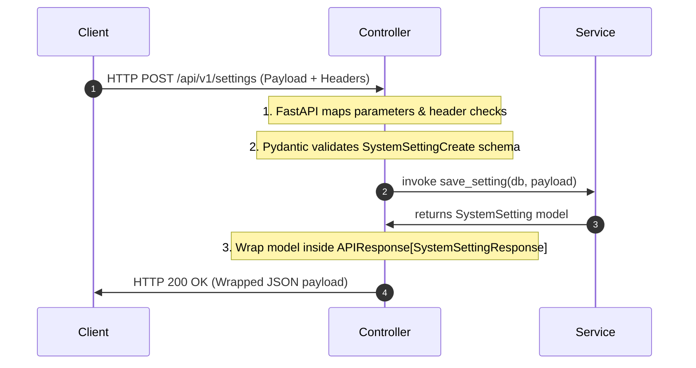

# Enterprise ERP: Controller/API Layer Architecture

This document defines the REST API routing rules, serialization schemas, HTTP request parsing, payload validations, and documentation tag settings for the Controller Layer.

---

## 1. REST API Routing Conventions

All endpoint controllers (residing in `app/api/v{version}/endpoints/`) must adopt RESTful routing standards:

| Action | HTTP Verb | Route Format | Description |
| :--- | :--- | :--- | :--- |
| **List Resource** | `GET` | `/api/v1/items` | Queries lists with pagination hooks |
| **Get Resource** | `GET` | `/api/v1/items/{id}` | Retrieves singular details by primary key |
| **Create Resource**| `POST` | `/api/v1/items` | Adds records; validates input schema |
| **Update Resource**| `PUT` / `PATCH` | `/api/v1/items/{id}` | Modifies record properties |
| **Delete Resource**| `DELETE`| `/api/v1/items/{id}` | Initiates soft deletion flags |

---

## 2. API Response Wrapping: `APIResponse`

To ensure uniform client processing, all endpoints must serialize outputs into the generic standard envelope `APIResponse` defined in `app/schemas/base.py`:

```json
{
  "success": true,
  "data": { ... },
  "message": "Resource query completed successfully",
  "meta": null
}
```

---

## 3. Implementation Workflow



---

## 4. Automatic OpenAPI Docs
*   Controllers must document schemas using standard FastAPI parameters (e.g. `response_model`, `tags`, and descriptive docstrings).
*   Interactive documentation is automatically hosted under `/docs` (Swagger UI) and `/redoc` (ReDoc UI).
