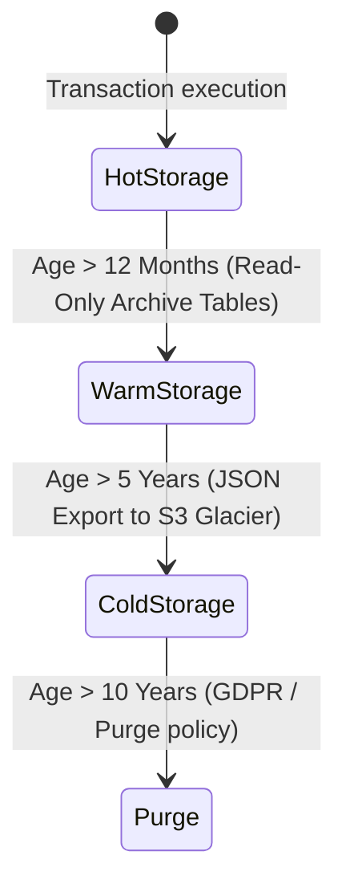

# Enterprise ERP: Database Architecture & Data Governance Design

This document details the database schema blueprint, indexing guidelines, partition schemes, PII data protection models, audit trail designs, and backup/archiving policies for the Enterprise Manufacturing ERP.

---

## 1. Physical Database Schema Blueprint (SQL DDL Blueprint)

Below are the DDL specifications for the core schema entities. All tables enforce character encoding `utf8mb4` for complete Unicode compatibility.

```sql
-- 1. Tenants Table
CREATE TABLE tenant (
    id VARCHAR(50) NOT NULL PRIMARY KEY,
    name VARCHAR(255) NOT NULL,
    subdomain VARCHAR(100) UNIQUE NULL,
    status VARCHAR(20) NOT NULL DEFAULT 'ACTIVE', -- ACTIVE, SUSPENDED, DELETED
    created_at TIMESTAMP DEFAULT CURRENT_TIMESTAMP,
    updated_at TIMESTAMP DEFAULT CURRENT_TIMESTAMP ON UPDATE CURRENT_TIMESTAMP
) ENGINE=InnoDB DEFAULT CHARSET=utf8mb4 COLLATE=utf8mb4_unicode_ci;

-- 2. Users Table
CREATE TABLE user (
    id VARCHAR(50) NOT NULL PRIMARY KEY,
    tenant_id VARCHAR(50) NOT NULL,
    email VARCHAR(255) NOT NULL,
    password_hash VARCHAR(255) NOT NULL,
    first_name VARCHAR(100) NULL,
    last_name VARCHAR(100) NULL,
    status VARCHAR(20) NOT NULL DEFAULT 'ACTIVE', -- ACTIVE, INACTIVE, LOCKED
    created_at TIMESTAMP DEFAULT CURRENT_TIMESTAMP,
    updated_at TIMESTAMP DEFAULT CURRENT_TIMESTAMP ON UPDATE CURRENT_TIMESTAMP,
    CONSTRAINT fk_user_tenant FOREIGN KEY (tenant_id) REFERENCES tenant(id) ON DELETE RESTRICT,
    UNIQUE KEY uq_user_tenant_email (tenant_id, email)
) ENGINE=InnoDB DEFAULT CHARSET=utf8mb4 COLLATE=utf8mb4_unicode_ci;

-- 3. Audit Trail Table (Partitioned by created_at)
CREATE TABLE audit_trail (
    id BIGINT NOT NULL AUTO_INCREMENT,
    tenant_id VARCHAR(50) NOT NULL,
    user_id VARCHAR(50) NOT NULL,
    action VARCHAR(20) NOT NULL, -- CREATE, UPDATE, DELETE, AUTH
    entity_name VARCHAR(50) NOT NULL, -- e.g., Item, WorkOrder
    entity_id VARCHAR(50) NOT NULL,
    pre_value JSON NULL,
    post_value JSON NULL,
    ip_address VARCHAR(45) NULL,
    created_at TIMESTAMP NOT NULL DEFAULT CURRENT_TIMESTAMP,
    PRIMARY KEY (id, created_at),
    KEY idx_audit_tenant_created (tenant_id, created_at)
) ENGINE=InnoDB DEFAULT CHARSET=utf8mb4 COLLATE=utf8mb4_unicode_ci
PARTITION BY RANGE (YEAR(created_at)) (
    PARTITION p2026 VALUES LESS THAN (2027),
    PARTITION p2027 VALUES LESS THAN (2028),
    PARTITION p_future VALUES LESS THAN MAXVALUE
);
```

---

## 2. Indexing Strategy & Performance Rules

To keep database reads responsive across thousands of tenants, we implement targeted indexing protocols.

### Composite Indexes:
Every index on tenant-specific tables must begin with `tenant_id`. This pattern, known as the **Prefixing Strategy**, enables MySQL's query optimizer to filter records by tenant first, ignoring other tenant rows entirely.

*   *Correct Composite Index:*
    `CREATE INDEX idx_item_tenant_sku ON item (tenant_id, sku);`
*   *Incorrect Composite Index:*
    `CREATE INDEX idx_item_sku ON item (sku);` -- Fails prefix partitioning efficiency.

### Covering Indexes:
For frequent operational queries, indexes must cover the requested fields to prevent lookup bounces back to the clustered primary key index.
*   Example for loading inventory levels:
    `CREATE INDEX idx_ledger_coverage ON stock_ledger (tenant_id, warehouse_id, item_id, quantity);`

---

## 3. Data Governance & Compliance (SOC 2, GDPR, ISO 27001)

Data governance policies are designed to satisfy enterprise regulatory controls.

### 1. Data Encryption (At Rest and In Transit)
*   **Transit:** Enforce SSL/TLS 1.3 connection strings for clients, and require encrypted tunnel connections between backend servers and the MySQL instances.
*   **Rest:** Enable InnoDB Tablespace Encryption. Database files are encrypted on block-level storage.

### 2. PII Protection and Data Masking
*   Store sensitive information (e.g. employee social security identifiers or custom pricing records) in dedicated columns.
*   Apply application-layer masking for logs and lower-privileged screens:
    *   *Real Email:* `admin@industrycorp.com`
    *   *Masked in System Logs:* `a***n@industrycorp.com`

### 3. Soft Delete Engine
Data deletions of major transactional records are restricted to soft-deletes:
*   Standard fields: `is_deleted` (TINYINT default 0) and `deleted_at` (TIMESTAMP null).
*   Any query automatically filters out `is_deleted = 1` unless specifically fetching historical data.

---

## 4. Archiving & Data Retention Strategy

Transactional logs and ledgers (`inventory_ledger`, `production_log`, `audit_trail`) grow quickly in large factories. We implement a tiered storage and archiving strategy:



1.  **Hot Storage (1 - 12 Months):** Live MySQL tables. High-performance, fully indexable SSD storage.
2.  **Warm Storage (12 - 60 Months):** Moved to secondary compressed partition storage. Optimized for analytical reads.
3.  **Cold Storage (5 - 10 Years):** Exported as compressed JSON logs to secure Object Storage (e.g. AWS S3 Glacier). Accessible only via manual administrative recovery requests.
4.  **Data Deletion (GDPR Right to Be Forgotten):** Tenant decommissioning triggers a cascade deletion script that permanently sweeps tenant ID values from databases.

---

## 5. Database Backup and Disaster Recovery (DR)

To guarantee high availability and prevent data loss, the ERP operates under the following Backup and Recovery SLA:

| Metric | Target SLA | Implementation Strategy |
| :--- | :--- | :--- |
| **Recovery Point Objective (RPO)** | **< 10 Minutes** | Automated binary log replication (Point-In-Time-Recovery) backed up to off-site object stores. |
| **Recovery Time Objective (RTO)** | **< 2 Hours** | Live MySQL Master-Slave configurations with automatic failover routers. |

### Backup Cadence:
*   **Daily:** Automated Full Backups utilizing `mysqldump` or enterprise-level physical snapshots (e.g., Percona XtraBackup) executed during off-peak hours.
*   **Hourly:** Incremental transaction log snapshots shipped to geo-redundant storage.
*   **Testing:** Backups are restored automatically monthly to an isolated verification staging sandbox to test snapshot integrity.
