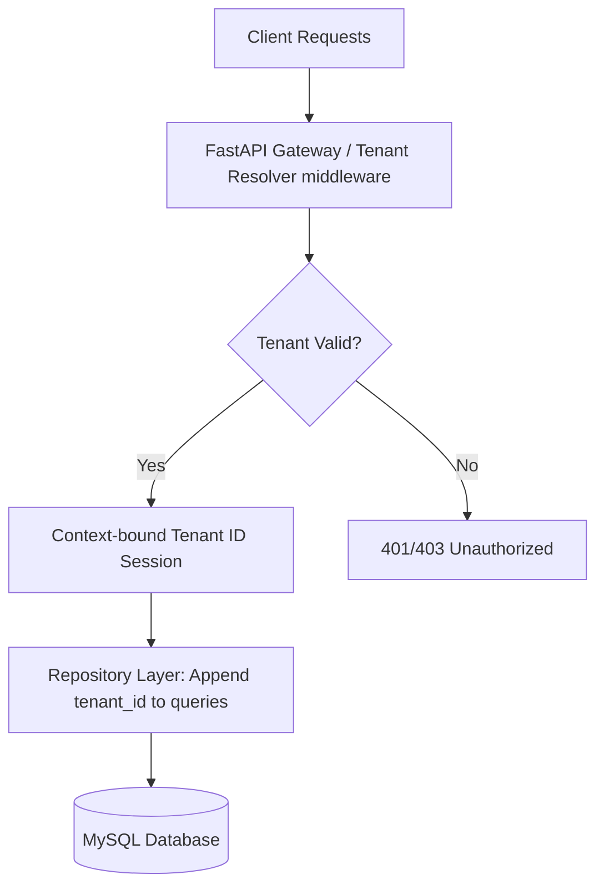

# Enterprise SaaS Manufacturing ERP: Product Requirement & Scope Definition

This document outlines the product requirements, architectural standards, database conventions, security specifications, and modular scope for the Enterprise SaaS Manufacturing ERP.

---

## 1. Executive Summary & Project Objectives

The goal is to build a professional, scalable, secure, and multi-tenant Manufacturing ERP designed for large enterprise customers and multinational organizations. The system will enable organizations to manage their end-to-end manufacturing operations, inventory, supply chain, and quality control while maintaining strict regulatory compliance, auditability, and data isolation.

### Key Objectives:
*   **Multi-Tenancy:** Ensure complete logical data isolation between tenants, with support for multi-company and multi-branch structures within a single tenant.
*   **Scalability & Performance:** Design a system capable of handling high transaction volumes, complex Bills of Materials (BOM), and heavy MRP calculations.
*   **Security & Compliance:** Implement role-based access control (RBAC), audit logging for all critical operations, and strong protection against common vulnerabilities.
*   **Data Entry Optimization:** Ensure the frontend user interface is clean, professional, responsive, and designed for efficient, low-latency data entry (keyboard navigation, batch inputs).

---

## 2. Multi-Tenant Architecture & Data Isolation

To support a secure SaaS model, the ERP will implement a **Shared Database, Shared Schema** multi-tenancy model with logical data isolation.



### Data Isolation Rules:
1.  **Tenant Resolution:** Every incoming API request must be authenticated, resolving the `tenant_id` from the JWT token claims.
2.  **Implicit Filtering:** The Repository layer must automatically append the active `tenant_id` to all database queries (select, insert, update, delete).
3.  **Cross-Tenant Guardrails:** Backend services must validate that foreign keys referenced in any payload belong to the same tenant.
4.  **Organizational Hierarchy:** Within a tenant, data can be further segmented by `company_id` and `branch_id` to support multinational organizational structures.

---

## 3. High-Level System Architecture & Folder Structure

The project follows a decoupled, MVC-inspired layered architecture to keep responsibilities separate and maintainable.

### Layer Separation:
*   **Model Layer:** Defines the SQLAlchemy ORM mapping and database schema.
*   **Repository Layer:** Performs raw database interactions (queries, transactions). No business logic.
*   **Service Layer:** Implements business logic, validations, workflows, and transaction boundaries.
*   **Controller/API Layer:** Handles HTTP requests, parses inputs, and serializes outputs using Pydantic schemas.
*   **Frontend UI Layer:** Responsive Next.js + React pages consuming the REST API.

### Target Workspace Folder Structure:
```text
IndustryOneERP/
├── backend/
│   ├── app/
│   │   ├── api/             # Controller / Route handlers
│   │   ├── core/            # Config, security, database session setup
│   │   ├── models/          # SQLAlchemy ORM models
│   │   ├── repositories/    # Database query abstraction
│   │   ├── schemas/         # Pydantic schemas (request/response validation)
│   │   ├── services/        # Core business logic & workflows
│   │   └── main.py          # FastAPI application entrypoint
│   ├── migrations/          # Alembic database migration scripts
│   ├── requirements.txt     # Python dependencies
│   └── alembic.ini          # Migration config
├── frontend/
│   ├── public/              # Static assets
│   ├── src/
│   │   ├── components/      # Reusable UI components (forms, tables, layouts)
│   │   ├── pages/           # Next.js pages/routes
│   │   ├── styles/          # Custom CSS stylesheets (overriding Bootstrap)
│   │   └── utils/           # API client, token helpers, formatters
│   ├── package.json         # Node.js dependencies & scripts
│   └── next.config.js       # Next.js configurations
└── docs/
    └── ERP_Product_Requirement_Scope_Definition.md
```

---

## 4. Core Modules & Feature Scope

The ERP roadmap is broken down into modular components:

| Module | Feature Scope | Key Database Entities |
| :--- | :--- | :--- |
| **System Administration** | Multi-tenancy, User management, RBAC, Audit Log, System Settings | Tenant, User, Role, Permission, AuditTrail |
| **Master Data (MDM)** | Items/SKUs, Bill of Materials (BOM), Work Centers, Routings | Item, BOM, WorkCenter, Routing, RoutingStep |
| **Inventory & Warehouse** | Multi-location stock tracking, stock adjustments, batch/serial tracking | Warehouse, InventoryLedger, StockAdjustment |
| **Production (MRP)** | Work Orders, Material Requirements Planning, scheduling, execution | WorkOrder, MRPRun, ProductionLog |
| **Procurement & Sales** | Vendor/Customer catalogs, Purchase Orders, Sales Orders | Customer, Vendor, PurchaseOrder, SalesOrder |
| **Quality Management** | Inspections, checklist templates, non-conformance logs | InspectionTemplate, QualityInspection, NCR |

---

## 5. Database Design Standards & Auditing Patterns

### Table Conventions:
*   Use singular snake_case names (e.g., `work_order`, not `work_orders`).
*   Every table must have a primary key named `id` (UUID or auto-increment bigint).
*   Foreign keys must be indexed and explicitly named (`fk_{source_table}_{target_table}`).
*   Soft deletes should be implemented using `is_deleted` and `deleted_at` fields where appropriate.

### Standard Audit Trail Fields (present in all transaction tables):
*   `tenant_id` (VARCHAR/UUID, indexed)
*   `created_by` (INT/UUID, FK to users)
*   `created_at` (TIMESTAMP, default current)
*   `updated_by` (INT/UUID, FK to users, nullable)
*   `updated_at` (TIMESTAMP, default current on update)

### Dedicated Audit Trail Log Table (`audit_trail`):
Stores structured history for compliance audits:
*   `id` (BigInt Auto-increment)
*   `tenant_id` (Indexed)
*   `user_id` (FK to User, track who performed action)
*   `action` (VARCHAR: 'CREATE', 'UPDATE', 'DELETE', 'APPROVE', etc.)
*   `entity_name` (VARCHAR, e.g., 'WorkOrder')
*   `entity_id` (VARCHAR, target record primary key)
*   `pre_value` (JSON, state before change)
*   `post_value` (JSON, state after change)
*   `ip_address` (VARCHAR)
*   `created_at` (TIMESTAMP)

---

## 6. API Design & Security Guidelines

### API Rules:
1.  **Strict REST Standards:** Use standard HTTP verbs (`GET`, `POST`, `PUT`, `DELETE`).
2.  **Standardized Response Envelope:**
    ```json
    {
      "success": true,
      "data": {},
      "message": "Operation completed successfully",
      "meta": {
        "page": 1,
        "limit": 10,
        "total_records": 100
      }
    }
    ```
3.  **Error Handling:** Never expose raw database or stack trace exceptions. Return structured error JSON (e.g., `400 Bad Request`, `422 Validation Error`, `401 Unauthorized`, `403 Forbidden`, `500 Internal Server Error`).

### Security Guards:
*   **JWT Authentication:** Use strong HS256/RS256 JWT tokens containing `user_id`, `tenant_id`, `company_id`, `branch_id`, and `roles`.
*   **RBAC Middleware:** API routes must be decorated with permission/role checks (e.g., `@require_permission("production:write")`).
*   **SQL Injection Prevention:** Enforce SQLAlchemy ORM usage; avoid raw SQL string concatenation.
*   **CORS & Rate Limiting:** Apply restrict headers and endpoint rate-limiting to prevent brute force.

---

## 7. Frontend UX/UI Standards

*   **Framework & Libraries:** Next.js pages/components styled using standard Bootstrap 5 with clean Vanilla CSS overrides to present a premium dark/light themed enterprise experience.
*   **Efficiency First:**
    *   No infinite scrolling for tables. Paginated server-side grids with filtering, sorting, and search inputs are mandatory.
    *   Responsive navigation panels (sidebar menus with collapse feature).
    *   Consistent forms with inline client-side validation and accessible error feedback.
*   **Global Layout:** Sidebar navigation, top header containing breadcrumbs, user profile dropdown, active Tenant selector, and branch switcher.

---

## 8. Phased Development Roadmap

The project execution will follow a sequential task structure:

*   **Task #1: ERP Product Requirement & Scope Definition** (Completed)
*   **Task #2: Core Framework Setup & Tenant/User Authentication (Backend & DB)**
*   **Task #3: Multi-tenant & Tenant-switch UI with Admin Dashboard (Frontend)**
*   **Task #4: Master Data Module (Items, BOMs, Work Centers)**
*   **Task #5: Inventory Control & Warehouse Management**
*   **Task #6: Sales & Procurement Order Processing**
*   **Task #7: Work Order Management & Shop Floor Execution**
*   **Task #8: Production Planning & MRP Engine**
*   **Task #9: Quality Control & Inspections**
*   **Task #10: Financial Ledgers & Manufacturing Costing**
