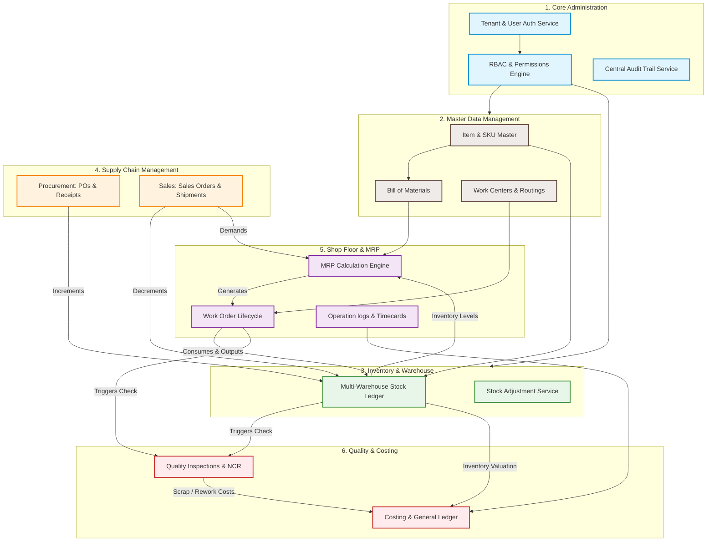
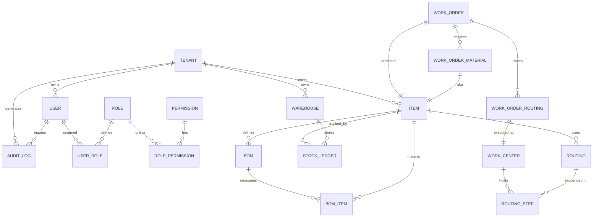

# Enterprise ERP: Module Map & Dependency Planning

This document defines the functional module architecture, dependency matrix, and data flow pipeline for the Enterprise SaaS Manufacturing ERP. It serves as the planning guide to ensure modules are built in a logical sequence with decoupled dependencies.

---

## 1. Enterprise Module Map (High-Level Data Flow)

The diagram below maps how business data flows across different modules. The system core (Tenant/User/RBAC) underpins all modules.



---

## 2. Technical Dependency Matrix

To build the ERP systematically, we must respect the dependency constraints of the layers and modules.

| Module Name | Direct Dependencies | Purpose of Dependency | Build Priority |
| :--- | :--- | :--- | :--- |
| **1. System Administration** | None (Core framework) | Resolves Tenant context, auth session, JWT validation, and central auditing. | **1 (Critical Path)** |
| **2. Item & SKU Master (MDM)** | System Administration | Every item requires tenant-level isolation and creator identification. | **2** |
| **3. Bill of Materials (BOM)** | Item Master (MDM) | A BOM links parent items to child components. | **3** |
| **4. Warehouses & Stock** | Item Master (MDM) | Ledger records track transactions for specific item SKUs. | **4** |
| **5. Procurement & Sales** | Warehouses & Stock | PO Receipts and Sales Shipments adjust real-time warehouse inventory. | **5** |
| **6. Work Centers & Routings** | System Administration | Defines the machinery, stations, and labor routines for production. | **6** |
| **7. Work Orders** | BOM, Work Centers, Stock | Work orders release components from stock and schedule them on routings. | **7** |
| **8. MRP Planning Engine** | Work Orders, Inventory, Sales | MRP reads inventory levels, purchase orders, sales demand, and schedules jobs. | **8** |
| **9. Quality Assurance** | Work Orders, Stock | Triggers inspections on inventory receipts or completed work order steps. | **9** |
| **10. Costing & Finance** | All Modules | Gathers stock material values, operation times, and scrap records to post ledgers. | **10** |

---

## 3. Component Layer & Cross-Cutting Architecture

The system uses a decoupled multi-layered MVC pattern:

```text
  [ Client UI (Next.js) ]
            │
            ▼ (REST JSON API)
  [ FastAPI Router/Controller ] (Schema Validation via Pydantic)
            │
            ▼
  [ Service Layer (Business Logic) ] (Transactions managed here)
            │
            ▼
  [ Repository Layer (Database Access) ] (Strict Tenant Isolation)
            │
            ▼
  [ Model Layer (SQLAlchemy ORM) ] (MySQL)
```

### Cross-Cutting Components:
1.  **Tenant Resolver Middleware:** Scans request headers for `X-Tenant-ID` or parses the authenticated JWT. Stores the resolved `tenant_id` in a thread-local or context-local store (`contextvars`).
2.  **Generic Repository Pattern:**
    *   Inherits from a base class that implicitly prepends `tenant_id = current_tenant()` on all `select`, `update`, `delete` queries.
    *   Prevents developer oversight leading to data leakage across tenants.
3.  **Global Audit Trail Service:**
    *   Exposes a `.log_change(db_session, user_id, action, entity_name, entity_id, before_json, after_json)` method.
    *   Runs asynchronously or inside the transaction context to ensure compliance.
4.  **Unit Conversion Engine:**
    *   Central service in MDM module handling physical standard conversions (e.g., kilograms to pounds, meters to feet) during material receipt and consumption.

---

## 4. Entity Relationship Schema Blueprint (Core Linkages)



---

## 5. Bootstrapping & Seed Data Plan

To launch the application successfully at Task #3, the database must contain critical reference configuration metadata:
1.  **Default Roles:**
    *   `SuperAdmin` (Cross-tenant administrator)
    *   `TenantAdmin` (Full control over single tenant)
    *   `ProductionManager` (Manage BOMs, routings, work orders)
    *   `InventoryManager` (Manage warehouses, adjustments, receipts)
    *   `PurchasingAgent` (Manage vendors and POs)
    *   `Operator` (Log operations on the shop floor)
2.  **Permissions Matrix:**
    *   `admin:*`
    *   `mdm:read`, `mdm:write`
    *   `inventory:read`, `inventory:write`
    *   `production:read`, `production:write`
    *   `purchase:read`, `purchase:write`
    *   `quality:read`, `quality:write`
3.  **Seed Data Routine:**
    *   FastAPI startup handler checks for empty roles and populates them.
    *   Alembic migration triggers basic static data injection.
