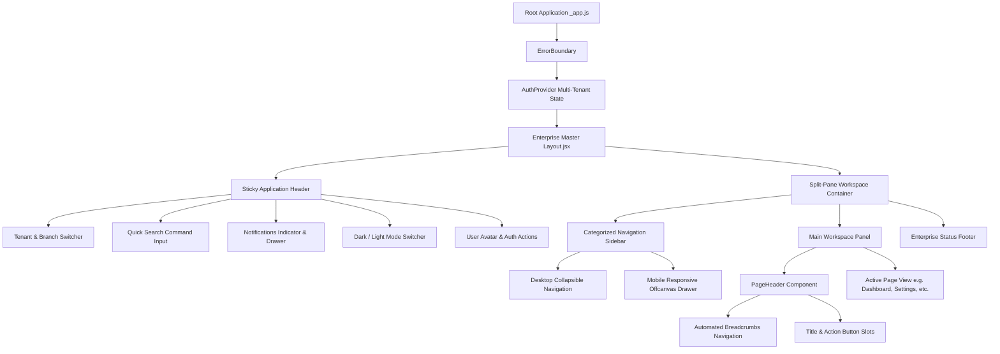

# Enterprise ERP: Enterprise Layout System Architecture

This document defines the architecture, component hierarchy, responsive layout shell, multi-tenant navigation, and breadcrumb system for the ERP Next.js frontend.

---

## 1. Component Hierarchy & Shell Layout

---

## 2. Layout Components Reference

| Component | Path | Description |
| :--- | :--- | :--- |
| `Layout.jsx` | `src/components/layout/Layout.jsx` | Master shell providing sticky header, collapsible/mobile sidebar, workspace, and footer. |
| `Header.jsx` | `src/components/layout/Header.jsx` | Top navigation bar with multi-tenant/branch switcher, quick search, notifications, theme toggle, and user profile menu. |
| `Sidebar.jsx` | `src/components/layout/Sidebar.jsx` | Categorized modular sidebar (Overview, Manufacturing, Supply, Finance, Admin) supporting desktop collapse and mobile offcanvas overlay. |
| `PageHeader.jsx` | `src/components/layout/PageHeader.jsx` | Standardized header for all ERP views featuring dynamic breadcrumbs, module icon, title, badge, and custom actions. |
| `Breadcrumbs.jsx` | `src/components/layout/Breadcrumbs.jsx` | Automated route-based breadcrumb tracker with custom trail override capabilities. |
| `Footer.jsx` | `src/components/layout/Footer.jsx` | System status bar displaying copyright, ERP version, connection state, and active tenant identifier. |

---

## 3. Responsive Breakpoints & Shell Behavior

- **Desktop (`>= 992px`)**:
  - Persistent left sidebar (`260px` expanded width, `72px` collapsed icon-only mode).
  - Quick search input enabled in header.
  - Organization & branch selectors visible inline.
- **Tablet / Mobile (`< 992px`)**:
  - Desktop sidebar hidden; toggled via hamburger button `☰` in header.
  - Offcanvas slide-in drawer (`280px` width) with backdrop click-to-dismiss.
  - Compact profile avatar and responsive breadcrumbs wrapping.

---

## 4. Multi-Tenant Context Integration

The `Header` component directly integrates with `useAuth()` to provide real-time organization and branch switching:
- `switchTenant(tenantId)`: Reconfigures active tenant context across localStorage and outbound API requests (`X-Tenant-ID`).
- `switchBranch(branchId)`: Updates facility/plant scope.
- `logout()`: Clears active tokens, tenant parameters, and redirects to login.
