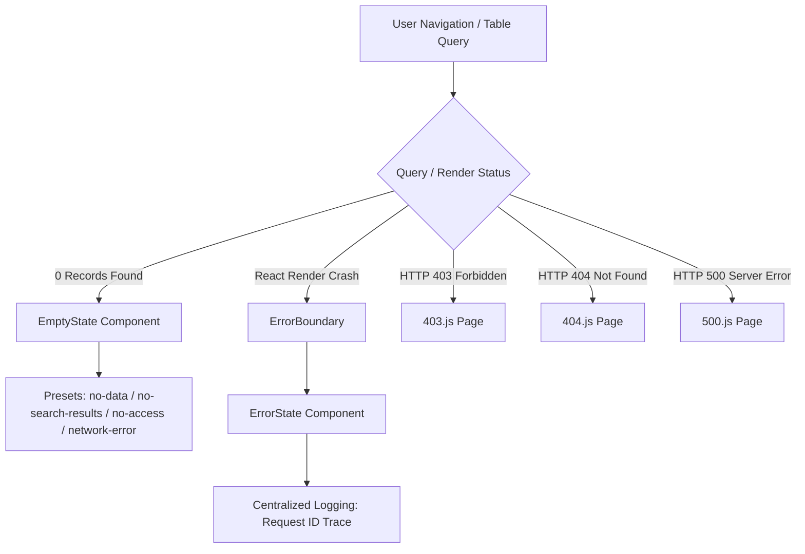

# Enterprise ERP: Error & Empty State System Architecture

This document defines the empty state presets, error handling components (`ErrorState`, `ErrorBoundary`), HTTP status screens (403, 404, 500), and request audit traceability.

---

## 1. Error & Empty State Architecture Overview



---

## 2. Component Catalog Reference

### 1. `EmptyState.jsx`
Configurable empty view placeholder supporting icons, titles, descriptions, and action buttons:
- **Presets**:
  - `no-data`: First-time creation / no master data.
  - `no-search-results`: Filter/search yielded 0 rows.
  - `no-access`: Role-Based Access Control (403 Forbidden).
  - `network-error`: Offline or backend unreachable.
- **Props**: `preset`, `icon`, `title`, `description`, `actionText`, `onAction`, `secondaryActionText`, `compact`.

### 2. `ErrorState.jsx`
Comprehensive error diagnostic screen supporting:
- **HTTP Badges**: Status indicators (400, 401, 403, 404, 500, 503).
- **Audit Traceability**: Displays and copies `request_id` (from the centralized logging system).
- **Diagnostics Collapse**: Toggles expandable technical stack trace details.
- **Recovery Actions**: `onRetry` button, Back to Dashboard link.

### 3. HTTP Error Pages
| Route | Component | Description |
| :--- | :--- | :--- |
| `/403` | `pages/403.js` | Tenant partition permission restriction screen. |
| `/404` | `pages/404.js` | Missing route / resource not found screen. |
| `/500` | `pages/500.js` | Internal server error recovery screen. |

---

## 3. Usage Examples

```jsx
import { EmptyState, ErrorState } from '@/components/common';

// Empty Table View
<EmptyState
  preset="no-search-results"
  title="No items found"
  actionText="Clear Filters"
  onAction={() => resetSearch()}
/>

// Async Error Screen
<ErrorState
  statusCode={500}
  title="Failed to Load Inventory Lots"
  requestId="req_84f93a"
  onRetry={() => refetch()}
/>
```
