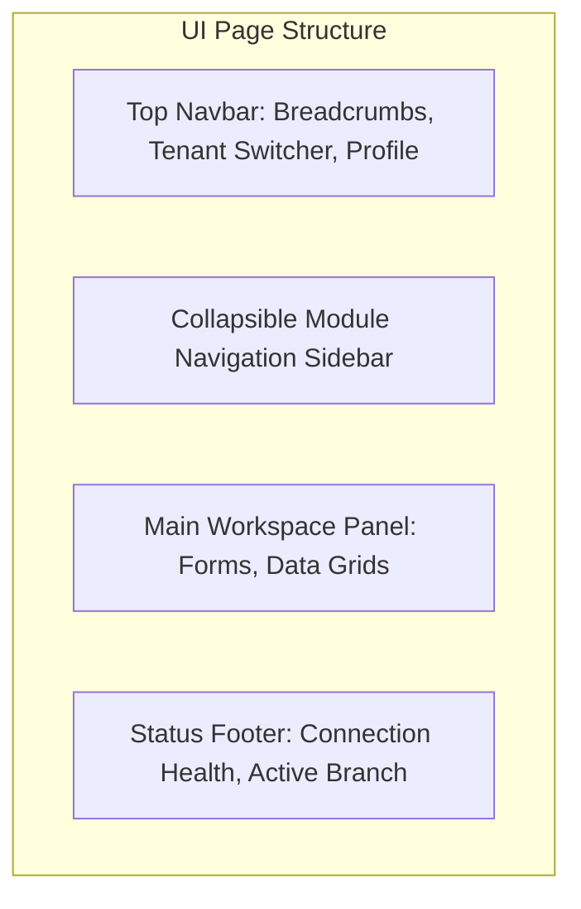
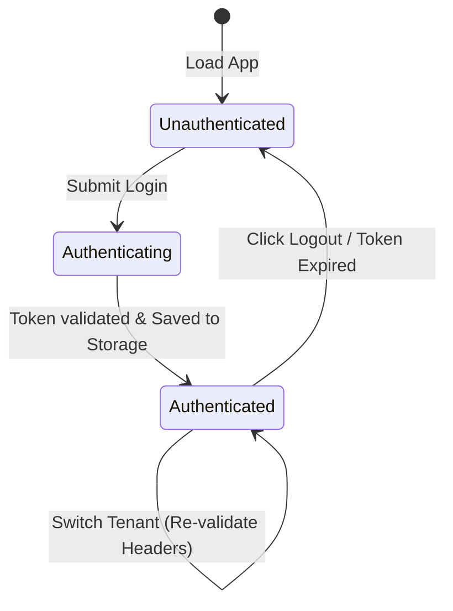

# Enterprise ERP: Frontend Architecture & UI/UX Design System

This document defines the client-side system architecture, UI style tokens, page layout parameters, component designs, API communication layers, and client-side security policies.

---

## 1. Technical Framework & Project Structure

The client application is built with **Next.js (React)**, utilizing **Bootstrap 5** for grid layout structures, complemented by clean **Vanilla CSS** tokens to present a custom enterprise experience.

### Key Layout Grid Rules:
*   **Desktop First for Data Entry:** Grids and pages optimize screen real estate. Use a fluid grid system (`.container-fluid`) with standard spacing utilities (`g-3`, `py-4`) to prevent whitespace bloating.
*   **Sidebar-Centric Layout:** The main navigation is anchored by a persistent, collapsible sidebar containing grouped ERP modules.



---

## 2. Brand Tokens & Color Palette (Light & Dark Theme Variables)

We define a premium custom theme override that matches modern SaaS design aesthetics. CSS custom properties (`variables.css`) are used to drive the styling system:

```css
:root {
  /* Core brand colors */
  --primary-color: #0d6efd;       /* Enterprise Blue */
  --primary-hover: #0b5ed7;
  --secondary-color: #4f46e5;     /* Indigo Accent */
  
  /* Status indicators */
  --success-color: #10b981;       /* Emerald Green */
  --warning-color: #f59e0b;       /* Amber Warning */
  --danger-color: #ef4444;        /* Crimson Red */
  
  /* Light Theme Layout */
  --bg-color: #f9fafb;
  --card-bg: #ffffff;
  --border-color: #e5e7eb;
  --text-primary: #111827;
  --text-secondary: #4b5563;
}

[data-theme="dark"] {
  /* Dark Theme Layout overrides */
  --bg-color: #0b0f19;
  --card-bg: #151b2a;
  --border-color: #222e45;
  --text-primary: #f9fafb;
  --text-secondary: #9ca3af;
}
```

---

## 3. Core Component Guidelines

### 1. Paginated Data Tables (`.erp-grid`)
*   Grid tables must be responsive (`.table-responsive`) and feature tight paddings (`.table-sm`).
*   **Hover effects:** Apply subtle background transitions to rows:
    ```css
    .erp-grid tbody tr:hover {
      background-color: rgba(13, 110, 253, 0.05);
      cursor: pointer;
    }
    ```
*   **Column Headers:** Headers must contain icons denoting sort states (e.g. up/down arrows).
*   **Pagers:** Standard footer showing `Page X of Y` beside a limit dropdown selector and next/prev arrow buttons.

### 2. Form Layouts & Batch Entries
*   Use floating labels (`.form-floating`) to reduce vertical form size.
*   Validation states must use Bootstrap validation classes (`.is-invalid`, `.is-valid`) and present clean error blocks (`.invalid-feedback`).
*   Form elements must support tab-key navigation, allowing keyboard-driven record creation without mouse usage.

---

## 4. API Client Interceptors (Axios Integration)

All communications to the backend API pass through a unified Axios instance configured with interceptor middleware.

```javascript
import axios from 'axios';

const apiClient = axios.create({
  baseURL: process.env.NEXT_PUBLIC_API_URL || 'http://localhost:8000/api/v1',
  timeout: 10000,
  headers: {
    'Content-Type': 'application/json',
  },
});

// Request Interceptor: Inject Auth JWT and Tenant Header
apiClient.interceptors.request.use(
  (config) => {
    const token = localStorage.getItem('auth_token');
    const tenantId = localStorage.getItem('active_tenant_id');
    
    if (token) {
      config.headers['Authorization'] = `Bearer ${token}`;
    }
    if (tenantId) {
      config.headers['X-Tenant-ID'] = tenantId;
    }
    return config;
  },
  (error) => Promise.reject(error)
);

// Response Interceptor: Global Error Mapping
apiClient.interceptors.response.use(
  (response) => response.data,
  (error) => {
    if (error.response) {
      const { status, data } = error.response;
      
      // Auto-logout on Token Expiry
      if (status === 401) {
        localStorage.removeItem('auth_token');
        window.location.href = '/login?expired=true';
      }
      
      // Pass mapped error envelope to UI
      return Promise.reject(data || { message: 'Unexpected server response' });
    }
    return Promise.reject({ message: 'Network error or server unreachable' });
  }
);

export default apiClient;
```

---

## 5. Auth Context & State Lifecycle

The frontend application coordinates authentication states through a global React Context (`AuthContext`):



### Context Payload:
*   `user`: Current user profile (ID, name, email).
*   `roles`: Active permissions claims arrays.
*   `tenants`: List of accessible tenants for the user (loaded if user is a SuperAdmin).
*   `activeTenant`: Currently selected Tenant metadata.
*   `activeBranch`: Currently selected target branch ID.
