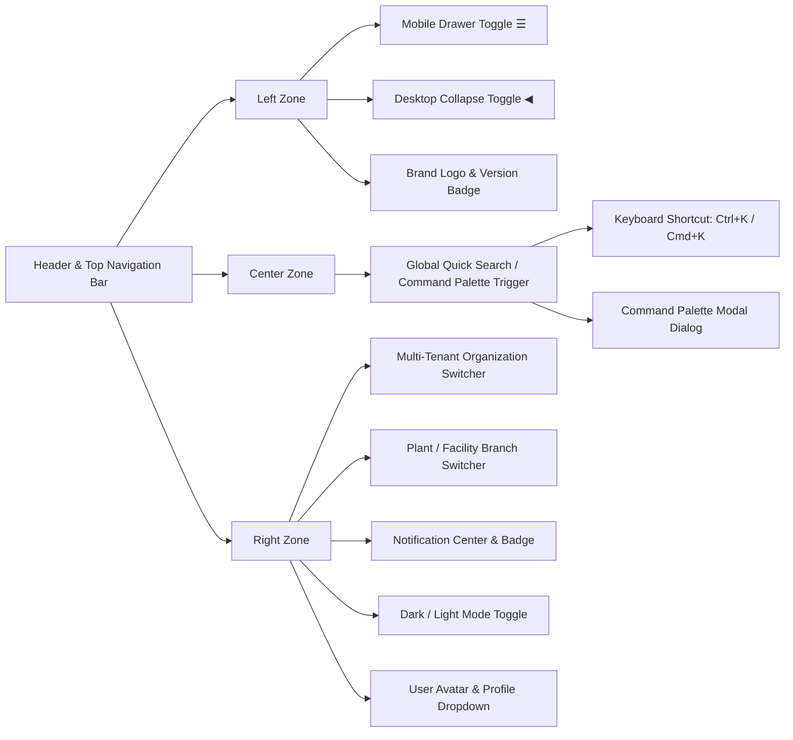

# Enterprise ERP: Header & Top Navigation Architecture

This document defines the top application navigation bar, global command palette (`Ctrl+K`), notification center, multi-tenant organization/branch selector, theme switcher, and profile management system.

---

## 1. Header Layout & Top Navigation Model

---

## 2. Key Components Reference

| Component | Path | Description |
| :--- | :--- | :--- |
| `Header.jsx` | `src/components/layout/Header.jsx` | Master top navigation bar integrating search, tenant/branch selection, alerts, theme, and user identity. |
| `CommandPalette.jsx` | `src/components/layout/CommandPalette.jsx` | Modal dialog triggered by `Ctrl+K` for keyboard-driven navigation across all ERP modules, sub-items, and keywords. |
| `NotificationDropdown.jsx` | `src/components/layout/NotificationDropdown.jsx` | Interactive notification center with unread count indicator, read status toggling, and item dismissal. |

---

## 3. Global Command Palette (`Ctrl+K`)

The `CommandPalette` indexes all items declared in `config/navigation.js` and provides:
- Instant fuzzy search across module titles, categories, and keyword synonyms.
- Full keyboard control: `↑` / `↓` for item selection, `↵ Enter` to jump, `Esc` to close.
- Category breadcrumbs in search results (e.g. `Manufacturing & Supply › Bills of Materials`).

---

## 4. Multi-Tenant & Security Integration

- **Organization Switcher**: Dynamically switches the active multi-tenant context via `switchTenant()` in `AuthContext`, updating localStorage and subsequent API headers (`X-Tenant-ID`).
- **Branch Switcher**: Changes facility/warehouse scope for plant-level manufacturing and stock queries.
- **Profile Menu**: Displays current user name, role, direct link to settings, and secure session sign out.
