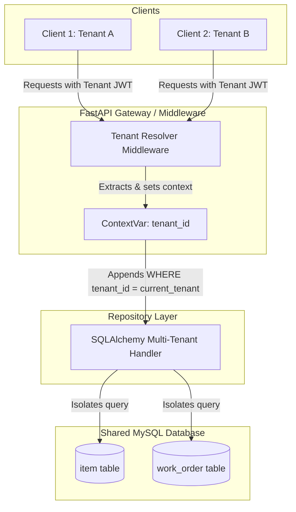
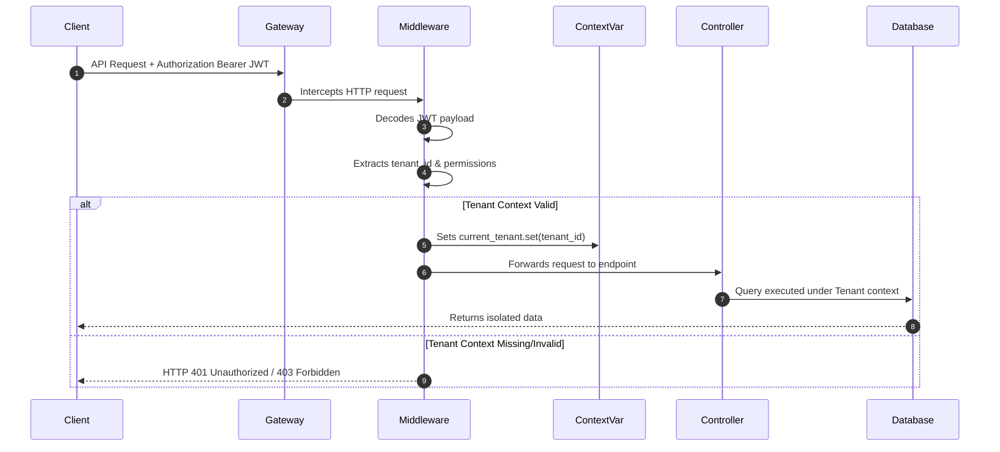

# Enterprise ERP: Multi-Tenant SaaS Architecture Design

This document details the multi-tenant SaaS architecture design, tenant context propagation, database schema isolation strategies, query-level safety enforcement, and tenant onboarding flows.

---

## 1. Multi-Tenancy Strategy: Shared Database, Shared Schema

We adopt a **Shared Database, Shared Schema** architecture. This provides optimal resource utilization, simple database maintenance (single migration run), and fast onboarding for new tenants, while enforcing logical isolation at the application layer.



### Key Mechanisms:
1.  **Row-Level Partitioning:** Every tenant-specific table contains a `tenant_id` field.
2.  **Context propagation:** The backend stores the current request's tenant ID in a thread-safe AsyncIO context wrapper (`contextvars.ContextVar`).
3.  **Automatic Filtering:** The repository layer interceptor automatically appends `WHERE tenant_id = <current_tenant>` to all SELECT, UPDATE, and DELETE operations.

---

## 2. Tenant Resolution Engine

Tenant identification is handled dynamically on each API request.



### ContextVar Helper Implementation:
```python
import contextvars
from typing import Optional

# Thread-safe context for asynchronous execution
_tenant_context: contextvars.ContextVar[Optional[str]] = contextvars.ContextVar(
    "tenant_id", default=None
)

class TenantContext:
    @staticmethod
    def get_current_tenant() -> Optional[str]:
        return _tenant_context.get()

    @staticmethod
    def set_current_tenant(tenant_id: str) -> contextvars.Token:
        return _tenant_context.set(tenant_id)

    @staticmethod
    def clear_current_tenant(token: contextvars.Token) -> None:
        _tenant_context.reset(token)
```

---

## 3. Generic Multi-Tenant Repository Pattern

To prevent developer errors (e.g., forgetting to append a tenant filter), we use a base repository class that handles query building.

```python
from typing import Generic, Type, TypeVar, List
from sqlalchemy.orm import Session
from app.models.base import Base  # Holds standard columns including tenant_id
from app.core.tenant import TenantContext

T = TypeVar("T", bound=Base)

class BaseMultiTenantRepository(Generic[T]):
    def __init__(self, model: Type[T]):
        self.model = model

    def get_by_id(self, db: Session, record_id: int) -> T:
        tenant_id = TenantContext.get_current_tenant()
        if not tenant_id:
            raise PermissionError("Access denied: No tenant context set.")
        
        return db.query(self.model).filter(
            self.model.id == record_id,
            self.model.tenant_id == tenant_id
        ).first()

    def list(self, db: Session, skip: int = 0, limit: int = 100) -> List[T]:
        tenant_id = TenantContext.get_current_tenant()
        if not tenant_id:
            raise PermissionError("Access denied: No tenant context set.")

        return db.query(self.model).filter(
            self.model.tenant_id == tenant_id
        ).offset(skip).limit(limit).all()

    def create(self, db: Session, obj_in) -> T:
        tenant_id = TenantContext.get_current_tenant()
        if not tenant_id:
            raise PermissionError("Access denied: No tenant context set.")

        db_obj = self.model(**obj_in.dict(), tenant_id=tenant_id)
        db.add(db_obj)
        db.commit()
        db.refresh(db_obj)
        return db_obj
```

---

## 4. Cross-Tenant Data Leakage Prevention (Security Guardrails)

We implement validation guardrails to ensure database operations cannot be bypassed:

1.  **Foreign Key Verification:**
    When referencing relational IDs (e.g., creating a `WorkOrder` referencing an `Item`), the service layer must run verification queries:
    ```python
    item = item_repository.get_by_id(db, payload.item_id)
    if not item:
        raise HTTPException(status_code=400, detail="Referenced item not found in your tenant.")
    ```
2.  **Explicit Tenant Mutation Block:**
    The `tenant_id` field in the models is defined with `updatable=False` or ignored in all `Pydantic` update schemas to prevent tenants from re-assigning their records to another tenant.

---

## 5. Tenant Provisioning Workflow

When a new organization registers, a database transaction executes a series of setup queries:

```mermaid
gantt
    title Tenant Onboarding Process Flow
    dateFormat  X
    axisFormat %d
    section DB Initialization
    Create Tenant Record           :active, a1, 0, 10
    Create Admin User Account      :active, a2, 10, 20
    section Master Setup
    Seed Tenant-Specific Roles    :active, a3, 20, 30
    Generate Default Warehouse     :active, a4, 30, 40
    Seed Base Unit of Measures     :active, a5, 40, 50
```



### Steps in the Provisioning Service:
1.  **Create Tenant:** Insert record in global `tenant` table.
2.  **Create Tenant Admin:** Insert record in `user` table linked to the tenant.
3.  **Assign Admin Role:** Assign `TenantAdmin` permissions to the user.
4.  **Seed Settings:** Insert default global parameters (e.g., fiscal year, currency, default timezone).
5.  **Onboarding Verification:** Send confirmation notification and log the auditing record.

---

## 6. Dynamic Frontend Tenant Selection & Context

*   **Context Storage:** The frontend client stores the active tenant metadata in local storage and holds it in the React State context.
*   **Header Propagation:** All outgoing Axios requests inject the active tenant ID in the HTTP header:
    ```javascript
    apiClient.interceptors.request.use((config) => {
      const tenantId = localStorage.getItem("tenant_id");
      if (tenantId) {
        config.headers["X-Tenant-ID"] = tenantId;
      }
      return config;
    });
    ```
*   **Dynamic UI Layouts:** Admin panel provides a Tenant Switcher dropdown (available only to users with the `SuperAdmin` global permission claim).
