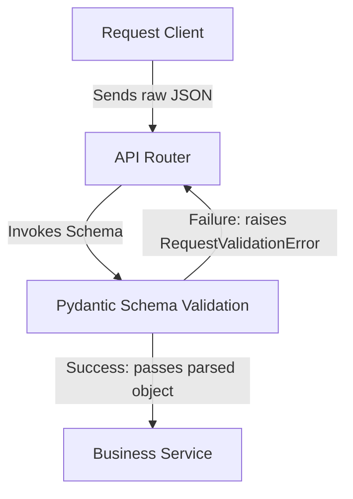

# Enterprise ERP: Pydantic Schema Layer Architecture

This document defines the schema data validation rules, serialization settings, and class config parameters for the Pydantic Schema Layer (Pydantic V2).

---

## 1. Role of Schemas in MVC Layering

Pydantic schemas (residing in `app/schemas/`) act as validation gates at the system ingress boundary.



---

## 2. Directory Hierarchy

```text
backend/app/schemas/
├── base.py              # Generic response envelopes (APIResponse)
└── setting.py           # System settings validation & response schemas
```

---

## 3. Pydantic V2 Configurations: `ConfigDict`

We strictly enforce Pydantic V2 configuration specifications. The deprecated V1 nested `class Config:` structure must **never** be used.

### Correct Implementation:
```python
from pydantic import BaseModel, ConfigDict

class SystemSettingResponse(BaseModel):
    id: str
    tenant_id: str

    model_config = ConfigDict(
        from_attributes=True,
        json_schema_extra={
            "example": { ... }
        }
    )
```

---

## 4. Validation Guidelines

*   **Field Constraints:** Always declare size parameters (e.g. `max_length=100`) for VARCHAR counterparts to match database column limits.
*   **Required Fields:** Use `...` as the default value to mark fields as strictly required by Pydantic.
*   **Default Values:** Declare defaults (e.g. `value_type: str = "string"`) where fallback parameters are desired.
