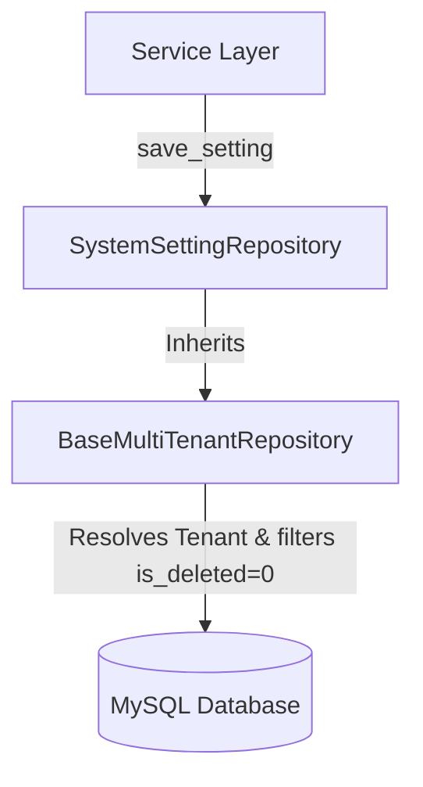

# Enterprise ERP: Repository Layer Architecture

This document defines the database query wrapping rules, multi-tenant partitioning filters, updates safeguards, and soft deletion patterns within the Repository Layer.

---

## 1. Generic Multi-Tenant CRUD Operations

All data layer interactions (queries, inserts, updates, deletes) must flow through subclasses of `BaseMultiTenantRepository` in `app/repositories/base.py`.



---

## 2. Dynamic Tenant Context Validation

*   Every database query must resolve the active tenant ID using the thread-safe `TenantContext.get_current_tenant()`.
*   If a request executes without a tenant context, a `PermissionError` is raised, blocking execution.

```python
def _get_tenant_id(self) -> str:
    tenant_id = TenantContext.get_current_tenant()
    if not tenant_id:
        raise PermissionError("Access Denied: No active Tenant context set.")
    return tenant_id
```

---

## 3. Operations Guardrails

### 1. Auto-Binding of Partition Keys
*   During `.create()`, the active tenant ID is fetched and mapped automatically to the model's `tenant_id` field. Developers do not need to pass this manually.

### 2. Update Safety
*   During `.update()`, the repository explicitly blocks updating the `tenant_id` column. Once created, a row cannot be re-assigned to a different tenant, protecting data bounds.

### 3. Logical Soft Deletion
*   Entities are never physically removed (`DELETE FROM ...`) from the database.
*   `.delete()` sets `is_deleted = True` and records the current timestamp in `deleted_at`.
*   List and retrieval queries automatically filter out rows where `is_deleted = True`.
