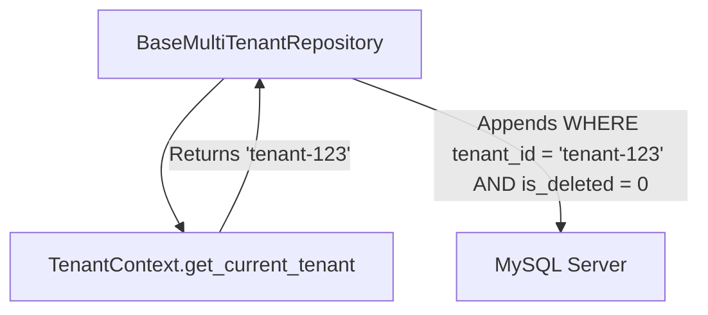

# Enterprise ERP: SQLAlchemy ORM Architecture

This document defines the Object-Relational Mapping (ORM) design guidelines, model inheritances, naming conventions, soft delete implementations, and multi-tenant partitioning conventions.

---

## 1. Declarative Base and Model Naming Conventions

All models must inherit from `Base` (imported from `app.core.database`) or its multi-tenant subclass `TenantBaseModel`.

| Property | Rule | Example |
| :--- | :--- | :--- |
| **Class Name** | `PascalCase` | `SystemSetting` |
| **Table Name** | `snake_case` (singular) | `system_setting` |
| **Column Names** | `snake_case` | `setting_value` |
| **Primary Keys** | String or UUID representation, index-enabled | `id = Column(String(50), primary_key=True)` |

---

## 2. Multi-Tenant Base Model: `TenantBaseModel`

To enforce tenant context separation, soft-delete safety, and auditability system-wide, operational entities must inherit from `TenantBaseModel` in `app/models/base.py`:

```python
class TenantBaseModel(Base):
    __abstract__ = True

    # Row-Level multi-tenant partition key
    tenant_id = Column(String(50), nullable=False, index=True)

    # Auditing columns
    created_at = Column(DateTime, default=datetime.utcnow, nullable=False)
    updated_at = Column(DateTime, default=datetime.utcnow, onupdate=datetime.utcnow, nullable=False)
    created_by = Column(String(50), nullable=True)
    updated_by = Column(String(50), nullable=True)

    # Logical Deletion
    is_deleted = Column(Boolean, default=False, nullable=False)
```

---

## 3. Query Partitioning Conventions

The repository base `BaseMultiTenantRepository` automatically appends tenant scope rules to database requests:



---

## 4. Enforcement Checks
To prevent developer mistakes, the test suite asserts:
1. Table names match `snake_case` checks.
2. Abstract flags are declared correctly for abstract base classes.
3. Every model subclassing `TenantBaseModel` maps the correct tracking and audit fields.
