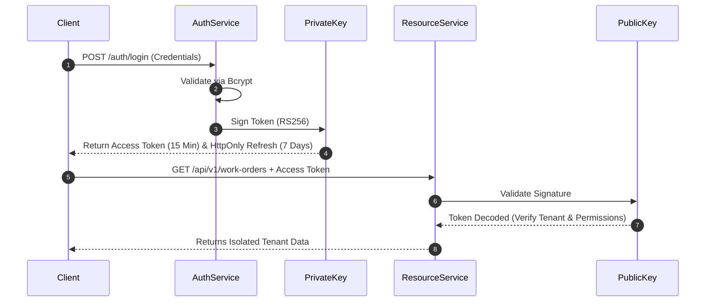

# Enterprise ERP: Security Architecture Design

This document details the security safeguards, authentication protocols, Role-Based Access Control (RBAC) schemes, threat protection rules, and regulatory audit definitions for the Enterprise ERP.

---

## 1. Authentication Security & Credentials Lifecycle

To protect user credentials and session tokens, the ERP implements strict cryptography policies.

### 1. Password Hashing
*   **Algorithm:** `bcrypt` (Blowfish-based key derivation function).
*   **Work Factor:** 12 rounds (striking the optimal balance between server-side login latency and GPU cracking resistance).
*   **Constraint:** Plaintext passwords are never logged, stored in cache, or transmitted over unencrypted HTTP.

### 2. Stateless Session Engine (JWT RS256)
Authentication sessions are managed using stateless JSON Web Tokens signed via asymmetric encryption (RS256).



*   **Access Token (Short-lived):** Valid for 15 minutes. Included in the HTTP `Authorization: Bearer <token>` header.
*   **Refresh Token (Long-lived):** Valid for 7 days. Stored inside a secure, `HttpOnly`, `SameSite=Strict`, `Secure` cookie, preventing access via client-side cross-site scripting (XSS) attacks.

---

## 2. Dynamic Role-Based Access Control (RBAC)

Authorization operates under a granular permission-based verification pipeline. Users are assigned one or more roles; roles bind directly to permission keys.

```text
[ User ] ──► (Assigned) ──► [ Roles ] ──► (Contains) ──► [ Permissions ]
```

### Core Permissions Mapping Matrix:

| Role Name | Permissions Set | Scope Constraints |
| :--- | :--- | :--- |
| **SuperAdmin** | `admin:*`, `*:*` | Cross-tenant administrative control. |
| **TenantAdmin** | `tenant:read`, `tenant:write`, `user:*`, `mdm:*`, `inventory:*`, `production:*` | Complete control within a single tenant boundary. |
| **ProductionManager**| `mdm:read`, `production:read`, `production:write`, `inventory:read` | Create BOMs, schedule routings, release Work Orders. |
| **InventoryManager** | `mdm:read`, `inventory:read`, `inventory:write` | Stock receipts, warehouse assignments, adjustments. |
| **Operator** | `production:read`, `production:log_operation` | Read work center schedules, log complete operations. |

---

## 3. Threat Protection & OWASP Top 10 Defenses

We incorporate application-layer guardrails to mitigate the common web application vulnerability patterns.

### 1. SQL Injection Prevention
*   Enforce parameter binding using SQLAlchemy ORM constructs.
*   *Strictly Forbidden:* Raw SQL string concats (e.g. `execute(f"SELECT * FROM items WHERE sku = '{input}'")`).
*   *Mandatory Pattern:* `execute(text("SELECT * FROM items WHERE sku = :sku"), {"sku": input})`.

### 2. Insecure Direct Object Reference (IDOR) / Tenant Leakage
*   Every data query must validate ownership.
*   Even if a user modifies an ID in an API payload (e.g. `PUT /api/v1/items/itm_other_tenant_id`), the repository query forces execution context constraints:
    ```python
    # Filter by primary key AND user tenant context to block cross-tenant IDORs
    query = db.query(Item).filter(Item.id == item_id, Item.tenant_id == current_tenant)
    ```

### 3. Cross-Site Scripting (XSS) & Content Security Policy (CSP)
*   **Frontend Output Encoding:** React default JSX automatically escapes variables before rendering.
*   **Secure Headers Middleware:** API response headers enforce protection policies:
    ```text
    Content-Security-Policy: default-src 'self'; frame-ancestors 'none';
    X-Frame-Options: DENY
    X-Content-Type-Options: nosniff
    Referrer-Policy: strict-origin-when-cross-origin
    ```

---

## 4. API Rate Limiting & Brute Force Lockouts

To prevent Denial of Service (DoS) and automated credential stuffing, the Gateway layer tracks client request frequencies.

### 1. Endpoint Rate Limiting
*   **Standard Operations:** 100 requests per minute per authenticated token.
*   **Auth Routes (`/auth/login`, `/auth/reset-password`):** 5 requests per minute per IP address.
*   *Storage:* Tracked in-memory or using Redis cache key-counters. Exceeding limits returns a `429 Too Many Requests` status code.

### 2. Brute-Force Lockout
*   An account is set to `LOCKED` status after **5 consecutive failed login attempts**.
*   Lockout Duration: 15 minutes (or requires administrative intervention via TenantAdmin override).

---

## 5. Security Event Audit Logging

All security-sensitive operations are captured in the global Audit Log. This collection is immutable (the API layer provides no update or delete routes for the `audit_trail` resource).

### Critical Events Logged:
1.  Failed login attempts (captures username, IP address, and timestamp).
2.  Successful logins and session refreshes.
3.  Changes to user roles or permission updates.
4.  Data exports (e.g. bulk downloads of inventory sheets or customer logs).
5.  Soft deletion of primary records (Items, BOMs, Users).
