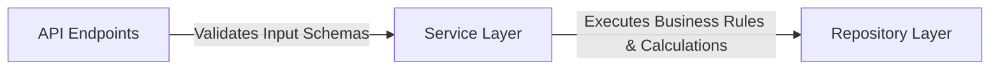

# Enterprise ERP: Service Layer Architecture

This document defines the rules for implementing business logic, transaction coordination, and validation scopes within the Service Layer.

---

## 1. Role of the Service Layer

The Service Layer (residing in `app/services/`) encapsulates the domain rules and business calculations of the ERP. It sits between the API Controllers (Endpoints) and the Repository Layer.



---

## 2. Implementation Guidelines

### 1. Separation of Concerns
*   **API Controllers** only handle HTTP parameters parsing, routing, and serialization wrapper formats. They should contain ZERO business logic.
*   **Repositories** only handle raw database access queries (CRUD), filters, and joins. They should contain ZERO business logic.
*   **Services** manage transaction coordination, permission checks, calculations, conversions, and third-party interactions.

### 2. Business Exception Handlers
*   Services must raise custom business exceptions (e.g. `ValidationException`, `PermissionException` defined in `app/core/exceptions.py`) when domain constraints are violated.
*   These exceptions automatically map to corresponding HTTP status responses via FastAPI's central handlers.

---

## 3. Configuration Conversions Example

The `SystemSettingService` handles parsing database-stored text configs into runtime Python types:

```python
# app/services/setting.py
class SystemSettingService:
    def get_value(self, db: Session, key: str, default: Any = None) -> Any:
        db_setting = system_setting_repository.get_by_key(db, key)
        if not db_setting:
            return default
        ...
        # Returns parsed int, float, bool, or string
```
