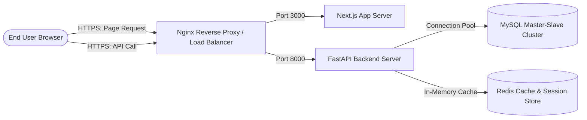

# Enterprise ERP: System Architecture Definition

This document defines the system-wide architecture patterns, technology stacks, folder structures, security frameworks, database connections, and coding standards for the Enterprise SaaS Manufacturing ERP.

---

## 1. Technical Stack & Deployment Architecture

The ERP is designed to run in a containerized environment utilizing a decoupled frontend-backend architecture.



*   **Frontend Client:** Next.js (Node.js) React framework styled with Bootstrap 5, featuring a state management solution (Context API/Zustand) and server-side rendering (SSR) for static/dynamic page optimization.
*   **Backend Server:** FastAPI (Python) running on an ASGI server (Uvicorn/Gunicorn), maximizing asynchronous query processing.
*   **Relational Database:** MySQL 8.0, with support for connection pooling, transactions, and binary logs for replication.
*   **Caching & Session Cache:** Redis (optional, for session management, token blocklists, and MRP calculation cache).

---

## 2. Directory Structure and Project Scaffolding

To ensure compliance with the MVC-inspired layered architecture, the codebase layout is structured as follows:

```text
IndustryOneERP/
├── backend/
│   ├── app/
│   │   ├── api/
│   │   │   ├── v1/
│   │   │   │   ├── endpoints/       # Route handlers (Controllers)
│   │   │   │   └── api.py           # V1 API router composition
│   │   │   └── middleware/          # Tenant resolver, Auth middleware, CORSMiddleware
│   │   ├── core/
│   │   │   ├── config.py            # Pydantic Settings management
│   │   │   ├── database.py          # SQLAlchemy engine & SessionLocal setup
│   │   │   ├── security.py          # JWT, hashing, crypto helpers
│   │   │   └── audit.py             # Shared Audit Logging service
│   │   ├── models/                  # Declarative SQLAlchemy models (Base model, Audit fields)
│   │   ├── repositories/            # Multi-tenant generic DB repositories
│   │   ├── schemas/                 # Input/Output validation (Pydantic models)
│   │   ├── services/                # Business processes & transaction scopes
│   │   └── main.py                  # App initialization (FastAPI config, middlewares, exception handlers)
│   ├── migrations/                  # Alembic environment and migration scripts
│   ├── tests/                       # Pytest test suite (unit, integration, api)
│   ├── alembic.ini                  # Alembic DB migration config
│   ├── requirements.txt             # Backend dependencies
│   └── Dockerfile                   # Backend Docker build instructions
├── frontend/
│   ├── public/                      # Static icons, image assets
│   ├── src/
│   │   ├── components/
│   │   │   ├── common/              # Buttons, inputs, modals, custom loaders
│   │   │   ├── layout/              # Sidebar navigation, Navbar header, Footer
│   │   │   └── tables/              # Paginated, filterable grid components
│   │   ├── pages/                   # Next.js Page components (Routing)
│   │   ├── services/                # API client interface (Axios instances)
│   │   ├── styles/                  # Global Bootstrap customize and theme files
│   │   └── utils/                   # Token utilities, validation rules
│   ├── package.json                 # Node dependencies
│   ├── next.config.js               # Next configurations
│   └── Dockerfile                   # Frontend Docker build instructions
└── docker-compose.yml               # Multi-container local execution setup
```

---

## 3. Database Connection Pooling & Lifecycle Management

Database interactions utilize SQLAlchemy 2.0 with connection pooling to handle high concurrency.

### Session Lifecycle Pattern:
1.  **Engine Configuration:**
    *   `pool_size=20` (default active connections in the pool).
    *   `max_overflow=10` (temporary connections allowed above pool size).
    *   `pool_recycle=3600` (recycle connections older than 1 hour to prevent timeout errors from MySQL).
2.  **Dependency Injection (`get_db`):**
    FastAPI endpoints obtain DB sessions using a generator function that guarantees session closure.
    ```python
    def get_db():
        db = SessionLocal()
        try:
            yield db
        finally:
            db.close()
    ```
3.  **Tenant Filter Hook:**
    All SELECT queries dynamically bind to the tenant context set by the middleware:
    ```python
    # Dynamic parameter binding in the Repository layer
    query = db.query(Model).filter(Model.tenant_id == current_tenant.get())
    ```

---

## 4. REST API Request / Response Lifecycle

Every HTTP request sent to the API executes through a strict processing pipeline:

```text
HTTP Request
     │
     ▼
[ Middlewares: CORS, Trusted Host ]
     │
     ▼
[ Tenant Resolver Middleware ] ──► (Resolves tenant_id, sets ContextVar)
     │
     ▼
[ Auth & Permission Dependency ] ──► (Validates JWT, verifies RBAC rules)
     │
     ▼
[ Request Validation ] ──► (Pydantic parses and validates body/query params)
     │
     ▼
[ Controller Endpoint ]
     │
     ▼
[ Service Layer Process ] ──► (Runs business validation inside DB transactions)
     │
     ▼
[ DB Repository Query ]
     │
     ▼
[ Pydantic Serializer ] ──► (Envelopes response: {success: true, data: ...})
     │
     ▼
HTTP Response
```

---

## 5. Security & Authentication Blueprint

*   **Data in Transit:** Enforce TLS (HTTPS) on all client-server communication.
*   **Authentication Engine:** Stateless token validation using JWT.
    *   **JWT Payload Structure:**
        ```json
        {
          "sub": "usr_9a2b8e",
          "tenant_id": "ten_112233",
          "company_id": "com_445566",
          "branch_id": "br_778899",
          "roles": ["ProductionManager"],
          "exp": 1723684800
        }
        ```
*   **Authorization Policy (RBAC):** Check permissions before handler execution.
    ```python
    @app.post("/items", response_model=ItemResponse)
    def create_item(
        payload: ItemCreate,
        db: Session = Depends(get_db),
        current_user = Depends(require_permission("mdm:write"))
    ):
        return item_service.create(db, payload)
    ```
*   **SQL Injection Prevention:** Use SQLAlchemy expression constructs. Raw SQL strings must bind parameters dynamically (e.g. `text("SELECT * FROM users WHERE name = :name")`).
*   **CORS Configuration:** Configure restrictive domains dynamically from environment variables.
*   **Password Hashing:** Store credentials using `bcrypt` (rounds=12).

---

## 6. Central Audit Trail Mechanism

To support compliance and security tracing, the Service layer must invoke the `AuditTrail` logger on any mutating business operation:

### Logging Strategy:
*   An audit write must run in the *same* database transaction as the entity change (ensuring atomicity).
*   Structure data inside the audit log to facilitate history timelines.

```python
# Audit Schema Model
class AuditTrail(Base):
    __tablename__ = "audit_trail"
    
    id = Column(BigInteger, primary_key=True, autoincrement=True)
    tenant_id = Column(String(50), nullable=False, index=True)
    user_id = Column(String(50), nullable=False)
    action = Column(String(20), nullable=False)  # CREATE, UPDATE, DELETE, etc.
    entity_name = Column(String(50), nullable=False)  # e.g., Item
    entity_id = Column(String(50), nullable=False)
    pre_value = Column(JSON, nullable=True)
    post_value = Column(JSON, nullable=True)
    created_at = Column(DateTime, default=datetime.utcnow)
```

---

## 7. Frontend Architecture and Styling System

*   **Design System:** Standard Bootstrap 5 theme with localized custom CSS overrides (`frontend/src/styles/variables.css`, `frontend/src/styles/custom.css`). Avoid arbitrary styles inside pages.
*   **State Control:** Use React Context API for global auth state and theme toggles. Use React state or specialized hooks for grid page/limit settings.
*   **API Layer:** Use custom `axios` instances with interceptors to automatically append JWT bearer tokens in the authorization header and catch `401 Unauthorized` errors to trigger re-authentication.
*   **SEO Elements:** Next.js metadata configured inside layout components. Standard semantic structure (`<header>`, `<nav>`, `<aside>`, `<main>`, `<footer>`) layout wrapper.
